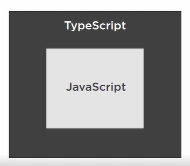
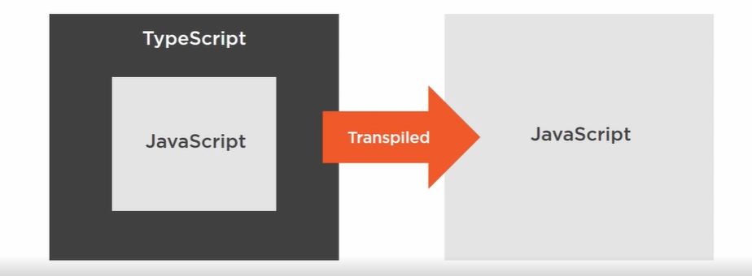

# TypeScript Overview
- Superset of JavaScript



- It is accomplished using transpilation(converting typescript code to javascript)



## TypeScript Features
- Static Typing
- Interfaces 
- Class properties
- Public/private Accessibility 

### Static Typing
// Static Typing allows us to specify data types for Variables,properties,parameters etc.
 
 // In Plain JavaScript we declare variables like this
 
 ```
 let name
 let age
 let birthDate
 ```
 
 // Adding typing with TypeScript is as simple as adding data types to the variable declaration like this
 
  ```
 let name:string
 let age:number
 let birthDate:date
 ```
 // with the datatypes in place and if user were to try to set any of these to an invalid value.for example setting an age to a string value then the typescript compiler throw an error and fail to transpile, catching the potential bugs earlier in  the process.
 
 
 ### Typescipt Interfaces
 
 TypeScript Interfaces takes typing little bit further,you can actually define interface for entire objects, and that will enforce the shape of object.
 If we want all dogs have a string name property and age as number property we could create a interface like this
 ```
 interface GDog{
    name : string
    age : number
  }
 // Given this declaration if this get compile time safety if we assign an object to loyal that is not include these fields with these types
  let loyal:GDog 
 ```
 Example where compilation fails
 1.
 ```
 loyal = {
 name: 'Jack',
 age: 'seven'
 }
 // this example would fail as age cannot be assigned as string ( compile time safety is being checked)
 ```
 2.
 
 ```
 loyal = {
 name: 'Jack'
 }
 // this example would fail as age is not optional 
 ```
 To make age property to be optional
 
 ```
  interface GDog{
    name : string
    age ? : number
  }
  let loyal:GDog 

 // this example would  not fail as age is optional property.
  loyal = {
 name: 'Jack'
 }
 ```
 
 ### TypeScript Class Properties
 
 
 
 
 
